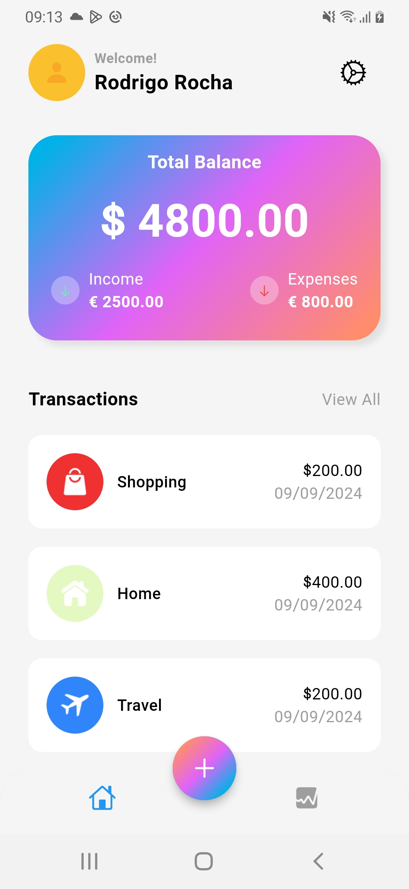
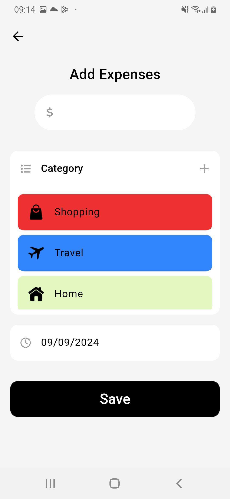

# Tracker App 🚶‍♂️📊

Bem-vindo ao repositório do **Tracker App**! Este projeto é uma aplicação web/mobile (ou outro formato, conforme aplicável) para monitorização de atividades físicas, como caminhadas, corridas e outras métricas de fitness. Os utilizadores podem registar suas atividades, acompanhar o progresso e visualizar relatórios detalhados.

## Demonstração

### Home Screen

 
### Categories List Screen

 
### Create Category Screen

 
### Transactions Screen

